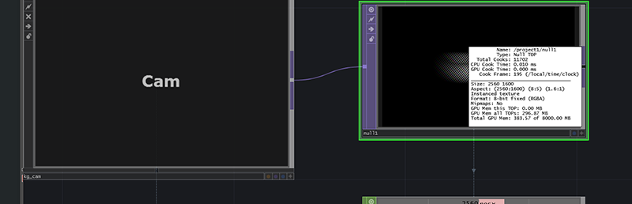
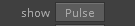

# Looking Glass Plugin for [Touch Designer 099](https://www.derivative.ca/)

## What is this?
This is a plugin that [we](https://www.besidedigital.com/) made to display content authored in Touch Designer on the Looking Glass 3D Holographic display made by Looking Glass Factory. It is native to Touch and requires minimal setup.

## Requirements
* Ability to display a 2560 x 1600 window in Touch Designer 099.
* A Looking Glass 3D Holographic Display.
* Web Drivers for Looking Glass
* A GPU that supports multi camera rendering. see [this article](https://docs.derivative.ca/Multi-Camera_Rendering) on the wiki

## Installation. 
* Follow the setup guide located [here](https://docs.lookingglassfactory.com/).

* We found it helpful to install [the library](https://docs.lookingglassfactory.com/Gettingstarted/library/) and run some example programs to make sure the display is working properly.

* Once you've seen a couple holograms we need to download the a driver to load the calbiration from the display. The threejs driver is a small program that reads calibration data from the USB and reports it via websockets. You can download it by following the [threejs tutorial](https://docs.lookingglassfactory.com/Three/guide/) or using [this link](http://look.glass/threejsdriver)

* Once you've got the drive and the display connected clone this repo and import the latest build from the tox directory into your patch to get started.

## Using The Component

* The component is designed to function like a normal TD camera. Place the camera component within the same scene as Geo comps and lights and the component will render these approriately. Simple camera operations(Translate, Rotate, Scale) are supported. Other camera operations are not(Look At, Path, e.t.c) and will produce unexpected results.
* you can render to the Looking Glass one of two ways. 
    1. The Tox exposes an TOP out the you can use in your own windowing setup

    

    2. Alternatively you can pulse the Show custom parameter. The Tox will attempt to identify which monitor connected is the Looking Glass and publish content directly to that monitor.

        

## Help I'm stuck!

* Every Touch Setup is different but open an issue on this repo and we'll try and help the best we can. Please describe your current hardware setup and other salient information. 

